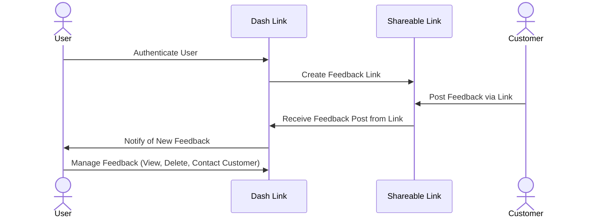

# DASH LINK

[Simon](https://simon.pro-dash-link.click)
[Start-Up](https://startup.pro-dash-link.click)

- [x] Proper use of Markdown
- [x] A concise and compelling elevator pitch
- [x] Description of key features
- [x] Description of how you will use each technology
- [x] One or more rough sketches of your application. Images must be embedded in this file using Markdown image references.

### Elevator pitch

Dash Link enables users to create shareable feedback links, allowing users to collect feedback effortlessly.
Users can manage all feedback in a single dashboard with real-time notifications and daily summaries.

### Design

Here is an idea of how users will interact with the website.

> I learned how to use mermaid! I think i turned out good 😎

### Key features

- Authenticated User Sign-In
- Feedback Shareable link Creation
- Unique Feedback Form tied to created Shareable Link (allows those with shareable link to post feedback)
- User Dashboard to view and "mark as read" feedback posts.
- Real-Time Notifications in Dashboard View (new feedback post notifications)
- Daily Email Summary of new feedback posts made
- CAPTCHA Spam protection for feedback posts

### Technologies

I am going to use the required technologies in the following ways...

- **HTML** - Website Skelton of visual structure of headers, buttons, and text of all pages of website.
- **CSS** - Desgin and Style of website such as fonts size & style, color scheme, animations, ect.
- **React** - Responsable for user interaction with all buttons, updating view with ceratin app states, allows for dynamic data to be show to user.
- **Web Service** - API integration with email provider to send daily notification emails. Google CAPTCHA API to secure forms from spam.
- **DB/Login** - Database will store user's sharable links and feedback posts. Authentcation will only allow authenicated users to use the service of creating shareblae links.
- **WebSocket** - Live notifications for when a new feedback post is made the user will be prompted that a new post was made.

### HTML Deliverable

#### 1. Home Page (index.html)

- **Purpose:** Landing page and login form.
- **Features:**
  - User login form (placeholder for authentication integration).
  - About section describing DashLink’s purpose.
  - Navigation links to log in and learn more.

#### 2. Client Dashboard (clientDashboard.html)

- **Purpose:** Main user dashboard to manage feedback links.
- **Features:**
  - Form to create new feedback links (API POST placeholder).
  - List of user feedback links (database placeholder).
  - Real-time notifications for new feedback posts (WebSocket placeholder).

#### 3. DashLink Dashboard (dashLinkDashboard.html)

- **Purpose:** Admin view for managing feedback posts on a specific feedback link.
- **Features:**
  - List of feedback posts with buttons to "Mark as Read" or delete posts (database and API placeholders).
  - Button to generate a downloadable QR code for the feedback link (3rd party API placeholder).

#### 4. Public Feedback Link (publicLink.html)

- **Purpose:** Public feedback form and post list for customers.
- **Features:**

  - Form for submitting feedback posts (API POST placeholder).
  - List of feedback posts with upvote buttons (database and WebSocket placeholders).

  ### CSS Deliverable

1. **Properly styled CSS header, footer, and main content body**
   - Header
      a.
   - Applied `data-theme="cupcake"` for a predefined color scheme.
   - Used `flex justify-between items-center bg-base-300 px-10 py-5` for structured spacing.

2. **Responsive Layouts**

   - Used `max-sm`, `max-md` for mobile-friendly adjustments.

3. **Theming with DaisyUI**

4. **Navigation Bar Styling**

5. **Cards & UI Components**

   - Implemented DaisyUI’s `card` component for feedback posts and dashboards.

6. **Form Styling**

   - Used `input input-bordered` for uniform input fields.

7. **Buttons & Interactive Elements**

   - Styled with `btn btn-primary`, `btn-outline`, and `btn-sm` for user actions.

8. **Typography Adjustments**

   - Applied `text-4xl font-bold` for titles and `text-sm font-light` for minor text.

9. **Grid & Flexbox Layouts**

   - Used `grid grid-cols-3` and `flex justify-between` for consistent positioning.

10. **Hover & Interactive Effects**

- Implemented `hover:text-primary` for smooth transitions on links/buttons.
