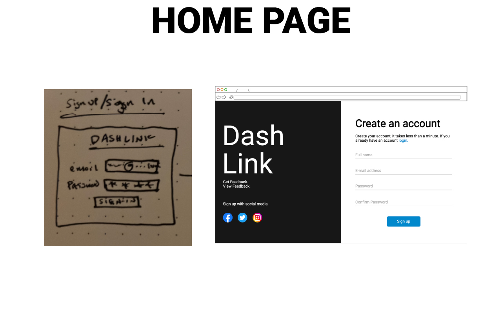
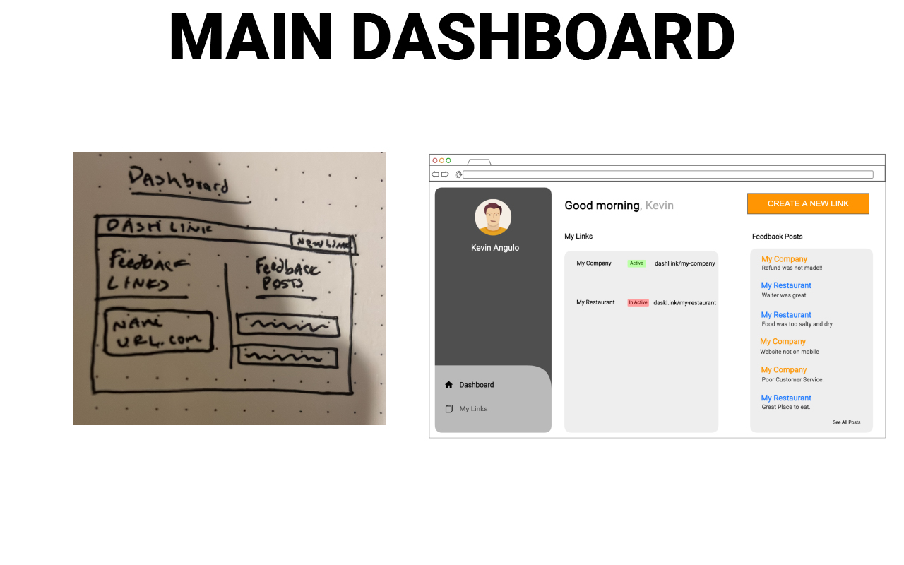
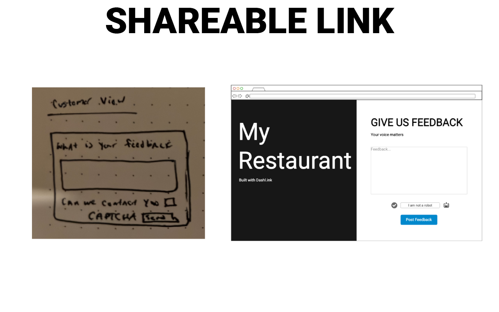
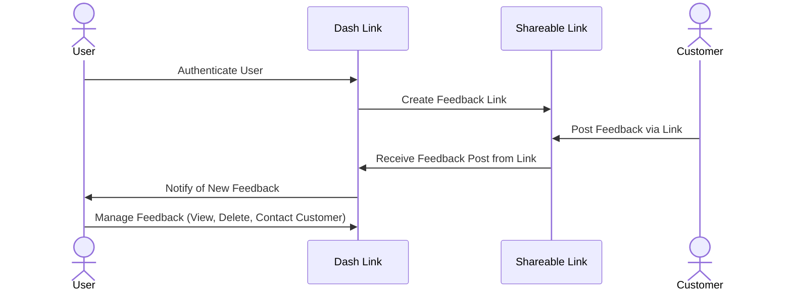

# DASH LINK

[Simon](https://simon.pro-dash-link.click)
[Start-Up](https://startup.pro-dash-link.click)

- [x] Proper use of Markdown
- [x] A concise and compelling elevator pitch
- [x] Description of key features
- [x] Description of how you will use each technology
- [x] One or more rough sketches of your application. Images must be embedded in this file using Markdown image references.

### Elevator pitch

Dash Link enables users to create shareable feedback links, allowing users to collect feedback effortlessly.
Users can manage all feedback in a single dashboard with real-time notifications and daily summaries.

### Design

Here is an idea of how users will interact with the website.

> I learned how to use mermaid! I think i turned out good 😎

### Key features

- Authenticated User Sign-In
- Feedback Shareable link Creation
- Unique Feedback Form tied to created Shareable Link (allows those with shareable link to post feedback)
- User Dashboard to view and "mark as read" feedback posts.
- Real-Time Notifications in Dashboard View (new feedback post notifications)
- Daily Email Summary of new feedback posts made
- CAPTCHA Spam protection for feedback posts

### Technologies

I am going to use the required technologies in the following ways...

- **HTML** - Website Skelton of visual structure of headers, buttons, and text of all pages of website.
- **CSS** - Desgin and Style of website such as fonts size & style, color scheme, animations, ect.
- **React** - Responsable for user interaction with all buttons, updating view with ceratin app states, allows for dynamic data to be show to user.
- **Web Service** - API integration with email provider to send daily notification emails. Google CAPTCHA API to secure forms from spam.
- **DB/Login** - Database will store user's sharable links and feedback posts. Authentcation will only allow authenicated users to use the service of creating shareblae links.
- **WebSocket** - Live notifications for when a new feedback post is made the user will be prompted that a new post was made.

### HTML Deliverable

#### 1. Home Page (index.html)

- **Purpose:** Landing page and login form.
- **Features:**
  - User login form (placeholder for authentication integration).
  - About section describing DashLink’s purpose.
  - Navigation links to log in and learn more.

#### 2. Client Dashboard (clientDashboard.html)

- **Purpose:** Main user dashboard to manage feedback links.
- **Features:**
  - Form to create new feedback links (API POST placeholder).
  - List of user feedback links (database placeholder).
  - Real-time notifications for new feedback posts (WebSocket placeholder).

#### 3. DashLink Dashboard (dashLinkDashboard.html)

- **Purpose:** Admin view for managing feedback posts on a specific feedback link.
- **Features:**
  - List of feedback posts with buttons to "Mark as Read" or delete posts (database and API placeholders).
  - Button to generate a downloadable QR code for the feedback link (3rd party API placeholder).

#### 4. Public Feedback Link (publicLink.html)

- **Purpose:** Public feedback form and post list for customers.
- **Features:**

  - Form for submitting feedback posts (API POST placeholder).
  - List of feedback posts with upvote buttons (database and WebSocket placeholders).

  ### CSS Deliverable

1. **Properly Styled Header, Footer, and Main Content Body**

   - Used **Tailwind's flexbox/grid system** (`flex`, `grid`) for structured layouts.
   - Applied **DaisyUI components** (`navbar`, `footer`, `container`) to ensure consistency.
   - Adjusted **padding (`py-4`) and margins (`my-6`)** for spacing.

2. **Properly Styled Navigation Elements**

   - Implemented a **responsive navbar** using `flex justify-between items-center`.
   - Styled navigation links with **hover effects** (`hover:text-primary`).
   - Used **DaisyUI’s `btn-link` and `btn-outline`** for interactive navigation elements.

3. **Responsive to Window Resizing**

   - Used **Tailwind’s breakpoint classes** (`sm:`, `md:`, `lg:`, `xl:`) for adaptive layouts.
   - Ensured a **fluid design** with `w-full` and `max-w-lg`.
   - Verified **responsiveness** using `flex-wrap` and `grid-cols-1 sm:grid-cols-2`.

4. **Properly Styled Application Elements**

   - Styled **cards, modals, and buttons** using **DaisyUI’s `card`, `btn`, and `modal` components**.
   - Used **box shadows (`shadow-lg`) and rounded borders (`rounded-xl`)** for a modern look.

5. **Properly Styled Application Text Content**

   - Applied **Tailwind typography** for headings (`text-3xl font-bold`) and body text (`text-base text-neutral`).
   - Used **DaisyUI’s alert component** for user feedback messages.

6. **Properly Styled Application Images**
   - Used `object-cover w-full h-auto rounded-lg` for responsive images.
   - Applied **Tailwind’s aspect-ratio utility** (`aspect-w-16 aspect-h-9`) for consistent scaling.
   - Integrated **hover effects** (`hover:opacity-75`) for interactive images.

### React Phase 1: Routing Deliverable

- [x] Port Simon CSS [Simon](https://simon.pro-dash-link.click)
- [x] Implement React into my frontend using Vite, React, and Tailwind CSS
- [x] My Name and Link to GitHub Repo in Footer
- [x] Git Commit History of React Frontend implementation
- [x] Notes Update of React Front End Use
- [x] Final version pushed to production to [Start-Up](https://startup.pro-dash-link.click)
- [x] Submitted on Canvas

  ### React Phase 2: Reactivity

- [x] **Ported Simon CSS** and deployed to [Simon](https://simon.pro-dash-link.click)
- [x] **Implemented reactivity** using `useState`, `useEffect`, and `setInterval`
- [x] **Footer includes** my name and GitHub repo link
- [x] **Git history** demonstrates steady progress and ownership of the code
- [x] **Updated notes.md** with learnings and component functionality
- [x] **Final version deployed** to [Startup App](https://startup.pro-dash-link.click)
- [x] **Assignment submitted** via Canvas

- `app.jsx`  
  Conditionally displays the "Dashboard" button based on whether a user is authenticated (checked using `localStorage`).

- `login.jsx`  
  Mocks a login experience with form input, uses `useState`, stores the "user" in `localStorage`, and routes to the dashboard.

- `clientDashboard.jsx`

  - Allows authenticated users to create new **DashLinks**
  - Uses `useState` for form state and DashLink list
  - Simulates **real-time notifications** for each DashLink with `setInterval`

- `dashlinkDashboard.jsx`

  - Lists posts tied to a selected DashLink
  - Supports upvoting, resolving, and deleting posts
  - Posts auto-sort by number of upvotes (descending)
  - Simulates upvote changes with `setInterval`
  - Includes "Copy Link" and "Download QR" (mocked behavior)

- `publicLink.jsx`
  - Allows any user to submit feedback (title + body)
  - Posts are rendered in real-time
  - Includes mock validation with a "captcha toggle"
  - Enables upvoting of public posts and sorts them live

---

### Startup Service

- [x] **Ported Simon Service** and deployed to [Simon](https://simon.pro-dash-link.click)
- [x] **Git history** demonstrates steady progress and ownership of the code
- [x] **Updated notes.md** with learnings and component functionality
- [x] **Final version deployed** to [Startup App](https://startup.pro-dash-link.click)
- [x] **Assignment submitted** via Canvas

### 🔹 5. Create an HTTP service using Node.js and Express
- Implemented full backend in `service/index.js`

---

### 🔹 6. Frontend served up using Express static middleware
- Configured with `express.static("public")` middleware
- Runs bundled frontend from Vite using standard setup

---

### 🔹 7. Your frontend calls third-party service endpoints
- Used the [goqr.me](https://goqr.me/api/) API to dynamically generate and download QR codes  
  - Integrated in `dashlinkDashboard.jsx` for the download button

---

### 🔹 8. Your backend provides service endpoints
- ✅ Fully working backend with these APIs:
  - `POST /api/auth/create` – Create new user
  - `POST /api/auth/login` – Login user
  - `DELETE /api/auth/logout` – Logout user
  - `GET /api/user/me` – Get authenticated user info
  - `POST /api/dashlink/create` – Create new dashlink
  - `GET /api/dashlink/list` – List user’s dashlinks
  - `GET /api/dashboard/list` – List all posts (protected)
  - `PUT /api/dashboard/resolved/:id` – Mark post as resolved
  - `DELETE /api/dashboard/delete/:id` – Delete post
  - `GET /api/post/list` – List public feedback posts
  - `PUT /api/post/upvote/:id` – Upvote a public post
  - `POST /api/post/create` – Submit a public feedback post

---

### 🔹 9. Your frontend calls your service endpoints
- Frontend fetches from backend using `/api/*` routes:
  - Auth logic in `login.jsx`
  - Dashlink creation/listing in `clientDashboard.jsx`
  - Post interaction in `dashlinkDashboard.jsx`
  - Anonymous post creation and upvoting in `publicLink.jsx`

---

### 🔹 10. Supports registration, login, logout, and restricted endpoint
- `/login.jsx` supports full register/login flow using backend
- Auth token stored in a secure, `httpOnly` cookie
- `ProtectedRoute.jsx` guards access to `/clientDashboard` and `/dashlinkDashboard`
- `/api/user/me` confirms current auth status before route access

---
