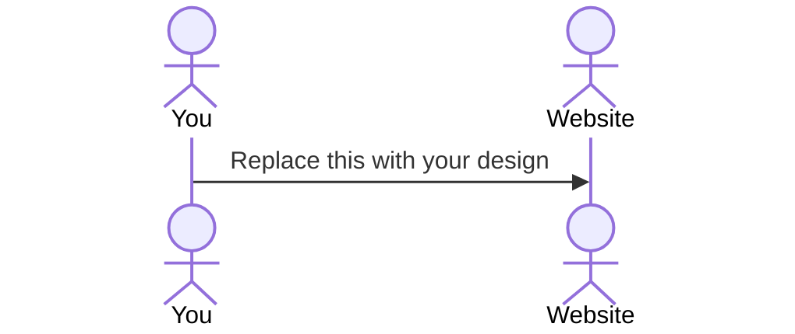

# DASH LINK

> [!NOTE]
>  Fill in this sections as the submission artifact for this deliverable. You can refer to this [example](https://github.com/webprogramming260/startup-example/blob/main/README.md) for inspiration.

For this deliverable I did the following. I checked the box `[x]` and added a description for things I completed.

- [ ] Proper use of Markdown
- [ ] A concise and compelling elevator pitch
- [ ] Description of key features
- [ ] Description of how you will use each technology
- [ ] One or more rough sketches of your application. Images must be embedded in this file using Markdown image references.

### Elevator pitch

Dash Link enables users to create shareable feedback links, allowing users to collect feedback effortlessly.
Users can manage all feedback in a single dashboard with real-time notifications and daily summaries.

### Design

Lorem ipsum dolor sit amet, consectetur adipiscing elit, sed do eiusmod tempor incididunt ut labore et dolore magna aliqua. Ut enim ad minim veniam, quis nostrud exercitation ullamco laboris nisi ut aliquip ex ea commodo consequat. Duis aute irure dolor in reprehenderit in voluptate velit esse cillum dolore eu fugiat nulla pariatur. Excepteur sint occaecat cupidatat non proident, sunt in culpa qui officia deserunt mollit anim id est laborum.

### Key features

- Authenticated User Sign-In
- Feedback Shareable link Creation
- Unique Feedback Form tied to created Shareable Link (allows those with shareable link to post feedback)
- User Dashboard to view and "mark as read" feedback posts.
- Real-Time Notifications in Dashboard View (new feedback post notifications)
- Daily Email Summary of new feedback posts made
- CAPTCHA Spam protection for feedback posts

### Technologies

I am going to use the required technologies in the following ways.

- **HTML** - Website Skelton of visual structure of headers, buttons, and text of all pages of website.
- **CSS** - Desgin and Style of website such as fonts size & style, color scheme, animations, ect.
- **React** - Responsable for user interaction with all buttons, updating view with ceratin app states, allows for dynamic data to be show to user.
- **Web Service** - API integration with email provider to send daily notification emails. Google CAPTCHA API to secure forms from spam.
- **DB/Login** - Database will store user's sharable links and feedback posts. Authentcation will only allow authenicated users to use the service of creating shareblae links. 
- **WebSocket** - Live notifications for when a new feedback post is made the user will be prompted that a new post was made. 